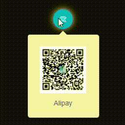

在个人博客的搭建过程中，我们有时候需要在文章的最后添加一个赞赏的组件，下面将展示如何使用纯CSS和HTML实现一个简单的赞赏组件

<!--more-->

## 1. 效果预览



## 2. 实现代码

### CSS

```css
.reward {
    margin: 14px;
    position: relative;
}

.reward-word {
    width: 40px;
    height: 40px;
    background: #00bcd4;
    text-align: center;
    border-radius: 50%;
    line-height: 40px;
    color: white;
    margin: 0 auto;
    box-shadow: 0 0 14px 0 #f5f5f5;
}

.reward-reward{
    cursor: pointer;
}

.reward-container {
    align-items: center;
    display: flex;
    flex-direction: column;
    position: absolute;
    left: 0;
    right: 0;
    margin: auto;
    width: 256px;
}

.reward-arrow {
    width: 0;
    height: 0;
    border: 8px solid;
    /*border-color: red yellow green blue;*/
    border-color: transparent transparent antiquewhite transparent;
    margin-top: -4px;
}

.reward-content {
    display: flex;
    flex-direction: column;
    align-items: center;
    background-color: antiquewhite;
    padding: 24px 24px 8px;
    border-radius: 4px;
    box-shadow: 1px 1px 1px 1px #f5f5f5;
}

.reward-img {
    height: 96px;
    width: 96px;
}

.reward-img-content {
    height: 100%;
    width: 100%;
    object-fit: cover;
}

.reward-img-word {
    font-size: 14px;
    color: #555;
}

.reward-word:hover .reward-container {
    visibility: visible;
}

.reward-word .reward-container {
    visibility: hidden;
}
```

### HTML

```html
<section class="reward">
    <div class="reward-word">
        <span class="reward-reward">赏</span>
        <div class="reward-container">
            <div class="reward-arrow"></div>
            <div class="reward-content">
                <div class="reward-img">
                    
                </div>
                <span class="reward-img-word">
            Alipay
        </span>
            </div>
        </div>
    </div>
</section>
```

## 3. 参考

### 实现元素水平居中

```css
/*父元素添加*/
margin: 0 auto;
```

### 实现元素垂直居中

```css
/*父元素添加*/
line-height: 40px;
height: 40px;
/*注意line-height与height数值相同*/
```

### 实现子元素相对定位不占空间

子元素将会以父元素为基准相对定位

```css
/*父元素属性*/
.parent {
    position: relative
}
/*子元素属性*/
.child {
    position: absolute
}
```

### CSS绘制箭头

```css
border: 8px solid;
/*border-color: red yellow green blue;*/
border-color: transparent transparent antiquewhite transparent;
```

### 父元素hover显示子元素

```css
.reward-word:hover .reward-container {
    visibility: visible;
}

.reward-word .reward-container {
    visibility: hidden;
}
```

### 图片居中显示，裁剪掉多余部分

```css
/*图片增加属性*/
.reward-img-content {
    height: 100%;
    width: 100%;
    object-fit: cover;
}
```

